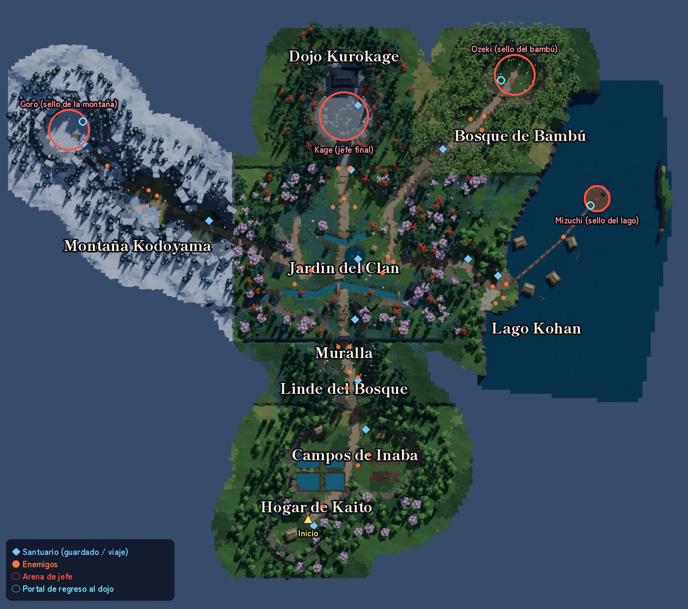
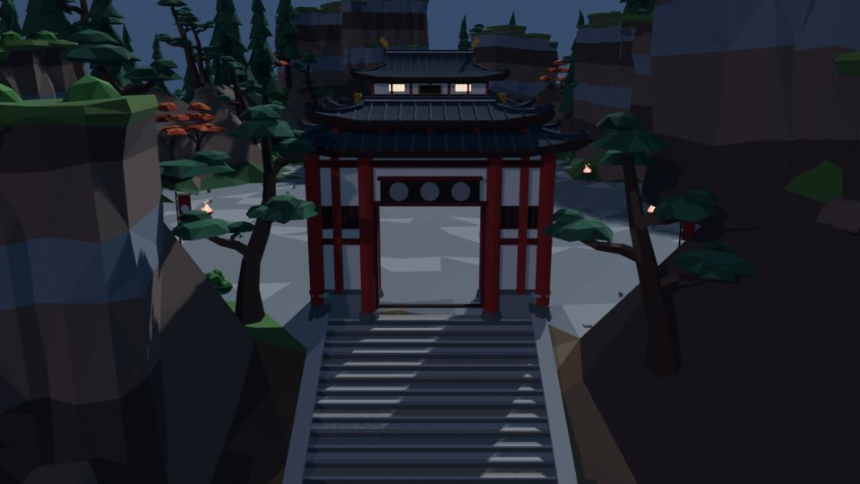
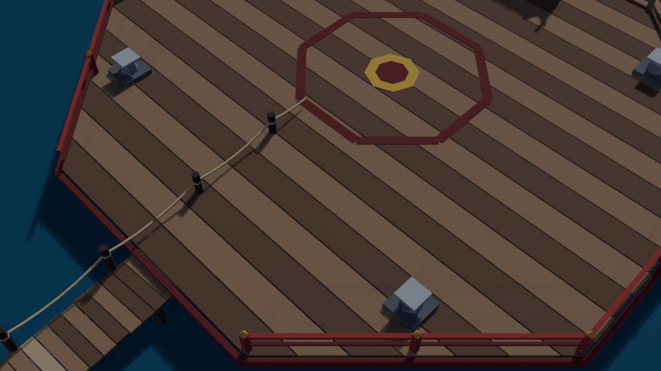
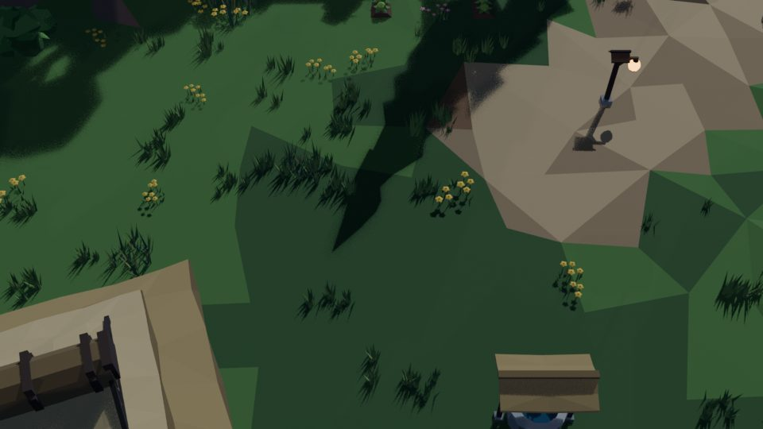
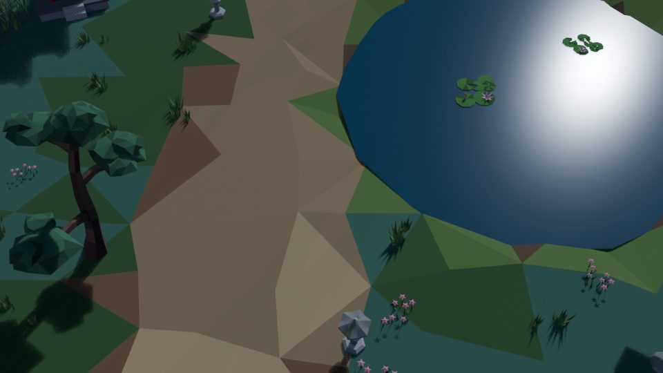

# Nindō — el camino ninja

Juego de acción ninja low‑poly con cámara elevada (estilo *Tunic*), hecho en Unity por
Felipe Doval, Teo González, Mateo Drault y Pedro Henríquez.

> Una noche, el clan Kurokage secuestra al abuelo de Kaito. La bandana del abuelo se le ata
> sola a la frente y la guadaña se convierte en katana: Kaito hereda todo lo que su abuelo
> sabía. Para abrir las puertas del Dojo Kurokage tiene que vencer a los tres guardianes
> —Goro en la Montaña Kodoyama, Mizuchi en el Lago Kohan y Ozeki en el Bosque de Bambú—,
> recuperar sus tres sellos y enfrentar a Kokuyō, el Señor del Clan Kurokage.



<p>
 
 
</p>

*(renders de previsualización hechos en Blender con la cámara del juego; en Unity la iluminación,
la niebla y el post-proceso cambian el resultado final)*

---

## Cómo abrirlo

1. Abrir la carpeta `Nindo/` con **Unity 6.3 LTS (6000.3.25f1)** desde el Hub (el proyecto ya
   está actualizado: URP 17.3, Input System 1.20, AI Navigation 2.0). La primera importación
   tarda: hay ~120 modelos y el audio.
2. Abrir `Assets/Nindo/Scenes/Menu.unity` y darle Play. `Nindo.unity` es la escena de juego
   (también se puede abrir directo para probar).
3. Si Unity pregunta por actualizar paquetes (URP, Input System, VFX Graph), aceptar.

**Las escenas casi no tienen nada a propósito**: solo un `GameBootstrap`. Todo el mundo
(terreno, props, enemigos, santuarios, jefes) se construye al arrancar a partir de los modelos
exportados desde Blender y del asset `Assets/Nindo/Resources/NindoContent.asset`.
Así nadie pisa la escena del otro en Git y el mapa se regenera con un comando.

### Para probar rápido (Inspector del `GameBootstrap` en `Nindo.unity`)

| Campo | Qué hace |
|---|---|
| `debugSkipIntro` | Saltea la cinemática del secuestro y da la katana. |
| `debugStartCheckpoint` | Arranca en un santuario: `cp_home`, `cp_fields`, `cp_forest`, `cp_wall`, `cp_garden`, `cp_dojo_gate`, `cp_mountain`, `cp_mountain_top`, `cp_lake`, `cp_lake_docks`, `cp_lake_falls`, `cp_bamboo`, `cp_bamboo_gate`, `cp_dojo`. |
| `debugUnlockAll` | Dash y habilidades desbloqueados desde el principio. |

`debugStartCheckpoint` también saltea el prólogo. La partida se guarda en un JSON en
`Application.persistentDataPath` y las opciones en `PlayerPrefs` (menú → *Nueva partida*
empieza de cero; *Nindo → Borrar partida guardada* la borra).

### Piloto automático para pruebas (`AutoPilot`, solo editor/development)

Maneja una entrada virtual de `InputReader`, así que funciona con el editor sin foco y a
cualquier framerate (pensado para probar por el MCP de Unity o desde tests):

```csharp
Nindo.AutoPilot.Run("waitcontrol 40; goto 0 94.5; move 0 1 4; talk; bot on");
Debug.Log(Nindo.AutoPilot.Stats);   // parries, daño recibido, ejecuciones...
```

`tap ACT [xN] [pausa]`, `hold ACT seg`, `down/up ACT`, `move X Y [seg]`, `wait seg`,
`talk [max]` (avanza diálogos), `waitcontrol [max]`, `goto X Z [max]` y `bot on|off`
(peleador automático: parry, dash a imparables, remates, ataques). `ACT` son los nombres de
`Act` (Attack, Parry, Dash, Finisher, Interact, Ability1, Ability2, Submit...).

---

## Controles

| Acción | Teclado / mouse | Mando |
|---|---|---|
| Moverse | WASD / flechas | Stick izq. |
| Atacar (combo de 3) | J / clic izq. | □ / X · R1 / RB |
| Parry (un toque justo antes del golpe; no hay guardia sostenida) | K / clic der. | L1 / LB |
| Esquiva (dash) | Espacio / Shift / L | ○ / B  ·  ✕ / A |
| Fijar objetivo (cambiar: stick der.) | Q / Tab / rueda | R3 |
| Remate / interactuar | F (E interactúa) | △ / Y |
| Corte del Viento (habilidad 1) | 1 / U | RT |
| Torbellino (habilidad 2) | 2 / I | LT |
| Pausa | Esc / P | Start |

## Sistema de combate (se mantuvo el formato original, pulido)

* **Parry**: cada toque abre una ventana corta (~0,24 s; los primeros ~0,11 s son
  *perfectos*), marcada con una media luna dorada delante de Kaito; mantener el botón no hace
  nada extra. Si el golpe llega dentro de la ventana se desvía, la escena se ilumina y el
  enemigo pierde postura; el contraataque inmediato pega más fuerte. Si el golpe llega apenas
  cerrada la ventana es una *guardia imperfecta* (35 % del daño, sin aturdimiento). Las primeras
  veces aparece "TEMPRANO" / "TARDE" sobre Kaito. Apretarlo al aire cuando no venía nada achica
  la ventana un instante (anti‑spam).
* **Postura**: si el enemigo termina su combo con al menos un parry encima queda **Exhausto**
  (hasta 4 golpes libres). Con la postura llena se **quiebra** (cámara lenta breve) y se lo
  puede **rematar**; también con poca vida. Los comunes se rematan rápido; la ejecución
  cinemática queda para élites, sumos, jefes y el último enemigo de la pelea.
* En **guardia** el primer golpe rebota (clang, le suma postura) y el segundo lo devuelve con
  un contraataque. En los últimos 0,3 s antes de su golpe un enemigo ya no se interrumpe con
  un corte liviano: hay que desviar o esquivar.
* **Aviso de cada golpe**: un anillo de tinta (ensō) se dibuja alrededor del atacante y se
  cierra justo cuando hay que apretar; un toc de madera (hyōshigi) suena a tiempo para
  reaccionar de oído. Dorado = parry; rojo dentado = no se desvía, dash. En el último tercio de
  segundo el **filo** del arma se enciende del mismo color (en el sumo, la mano o el pie que pega).
* **Ataques imparables (anillo rojo dentado + zona roja, y un rombo rojo con ">>" sobre el
  enemigo)**: no se desvían; se esquivan con el dash cuando el anillo se cierra. La esquiva perfecta también ralentiza el tiempo (como mucho
  una vez cada 6 s).
* **Espíritu (maná)**: se llena con parries y golpes; lo gastan el dash, el remate y las dos
  habilidades. Sin Espíritu igual hay un dash *cansado* (más corto, con espera de 1,2 s). Al usar una habilidad la cámara se mueve detrás de Kaito (Corte del Viento:
  sobre el hombro; Torbellino: órbita baja).
* **Filo de Ira**: jugar bien (parries, golpes, sin recibir daño) lo carga; lleno, la katana se
  prende fuego y pega más fuerte durante 9 s, y cada golpe lo estira un poco. Matar cura un poco.
* Los enemigos atacan por turnos (*tokens*) para que las peleas grupales se lean bien.
* **Variantes de zona**: además del kit y del modo de moverse, cada zona pelea distinto. Montaña:
  más lentos y pesados, el ninja cierra un combo con un tajo de arriba **imparable**; el sumo pisa
  un shiko imparable que levanta nieve. Lago: el ninja gira un remolino de 360° y tira el arpón
  desde lejos; el sumo empuja a dos manos y te saca lejos. Bambú: el ninja entra de un salto
  desde 4-6.5 m y se repliega después del combo; el sumo se corre de costado y embiste.
* **Sumos**: sus clips casi no se mueven desde arriba, así que cada golpe lleva una pose
  procedural atada al aviso (`Enemies/SumoPoser`): la mano atrás antes de la bofetada, la
  pierna arriba en el shiko, agachado con los puños en el piso antes de embestir.
* **Ōzeki** (jefe del bambú, `Enemies/Bosses/OzekiBoss`): bofetadas doradas en ritmo, agarre
  rojo (los brazos abiertos), shiko rojo cuya onda se abre por el piso hasta 8 m (dash cuando
  llega o salir del disco) y tachiai rojo; las matas de bambú joven del claro frenan la
  embestida y lo dejan abierto. A la mitad se le enciende la tsuna, tira sal (no pega: es un
  respiro para castigarlo) y alarga los combos.
* **Cámara de combate**: baja a 45° y fijada nunca queda a menos de 19 m ni gira (los controles
  no cambian de dirección); con Kaito casi centrado se ven ~5 m detrás de él. Lo que tapa a
  Kaito, al fijado, al jefe o a quien está por pegar se disuelve con una trama (hueco en cono,
  también en las tomas de habilidad; lo pegado a la cámara, entero). Un aviso que arranca fuera
  de pantalla no mueve la cámara: se marca en el borde con un trazo de pincel y un ensō chico
  (dorado = parry, rojo doble = dash). El sonido se oye desde Kaito; avisos y parry no cambian
  de tono con la cámara lenta.
* **Reintentos**: pasar a menos de 6 m de un santuario ya lo deja como punto de reaparición
  (rezar además cura y guarda). Hay santuarios a la entrada de las arenas de Mizuchi y Ōzeki,
  morir devuelve al juego en ~3,6 s y la presentación completa de cada jefe sale solo la
  primera vez.

## HUD e interfaz ("Tinta y Bandana")

El HUD es **solo** el arte del equipo: la **bandana roja** (vida) y el **dragón dorado**
(Espíritu). No hay barras aparte; todo se lee en ellos:

* **Dragón**: el oro es el Espíritu. El **lomo** se enciende como brasa de la cola a la cabeza
  a medida que se carga el Filo de Ira (aunque el Espíritu esté vacío); listo para encenderse le
  salen lenguas de fuego y le arde el ojo; activo, el dragón arde y las llamas se retiran hacia
  la cola con el tiempo que queda; si un golpe le saca carga, el tramo perdido se vuelve ceniza
  (brasas grises y un lomo apagado que se vacía). Si algo no alcanza, se raya en rojo lo que falta; sin Espíritu
  para el dash el oro se apaga y el dragón entrecierra el ojo (lo cierra mientras el dash cansado
  se recupera). Destella al pasar los umbrales del dash, el remate y las habilidades.
* **Bandana**: flamea, destella al recibir un golpe (lo perdido queda claro y se vacía despacio),
  brilla al curarse y late con poca vida (`UI/UIBeat`, el mismo latido para todo).
* Arriba a la derecha, fuera del combate: los tres **sellos** (pictogramas: montaña, olas, bambú)
  y el **objetivo**. En la pelea se apartan: quedan solo la bandana y el dragón.
* Sobre los enemigos: barra de tinta con los rombos de **postura**, el **kunai dorado** del
  fijado (arriba, nunca sobre el cuerpo: ahí se lee la anticipación del golpe), la cinta de
  **Ejecutar** con su tecla y las marcas (alerta, imparable, guardia). Los avisos de combate de
  Kaito ("¡FILO DE IRA!", "¡Parry!") salen sobre su cabeza; los de progreso, en cola debajo
  de la franja del HUD (donde va el título de zona, al que esperan).
* En los textos de consejos y diálogos, `{Parry}`, `{Attack}`... (nombres de `Act`) se dibujan
  como la tecla del dispositivo de ese momento y cambian si se pasa del teclado al mando.
* Sin kanji ni símbolos japoneses: los sellos de los títulos de zona son pictogramas en rojo.
  Las teclas se dibujan según el dispositivo (teclado, Xbox o PlayStation).
* **Opciones**: volúmenes, sacudida, cámara lenta, vibración, pantalla completa, calidad y
  **Avisos de combate** (todos / solo imparables / ninguno, `Settings.CombatAids`): los anillos
  ensō con sus zonas del piso y las marcas sobre los enemigos. El filo encendido, las poses y
  los sonidos del aviso quedan siempre; la práctica del prólogo dibuja los anillos igual.

---

## Estructura del proyecto

```
Nindo/Assets/Nindo/
  Scripts/        todo el código nuevo (namespace Nindo)
    Core/         Game (service locator), GameBootstrap, eventos, guardado, NindoContent, fábricas
    Input/        InputReader (teclado + mando, buffer de inputs)
    Combat/       tipos de ataque, CombatDirector (tokens), CharacterAnimator (CrossFade por código)
    Player/       PlayerController (+ .Combat), PlayerConfig
    Enemies/      Enemy, Boss, arquetipos (ninja, sumo, goro, mizuchi, ozeki, kage…), variantes de zona,
                  poses del sumo (SumoPoser)
      Bosses/     jefes con pelea propia: MizuchiBoss (el Gran Koi: KoiBody, perlas, saltos, ola, pilares), OzekiBoss (yokozuna), KokuyoBoss (jefe final: actos, sombra adelantada, Kage, eclipse)
    Camera/       CameraDirector (tomas mezclables, fijado, perfiles de jefe, golpe de FOV, oído sobre
                  Kaito), CameraOcclusion (disolución de lo que tapa, shader Nindo/Occluder Fade)
    FX/           partículas, hit-stop, post-proceso en runtime (URP Volume)
    Audio/        AudioManager: música por zona/combate/jefe, ambientes, efectos con pool
    UI/           HUD, menús, diálogos (todo creado por código)
    World/        WorldBuilder (arma el mapa desde los FBX), áreas, interactuables
    Story/        StoryDirector (cinemáticas, objetivos), StoryText (TODOS los textos), NPC
  Art/            modelos (props, mundo, abuelo), materiales, paleta, UI, fuentes
  Animation/      AnimatorControllers generados (usan los .anim originales del equipo)
  Audio/          Sfx/, Ambience/, Music/ (+ CREDITS.md)
  Resources/      NindoContent.asset (referencias a todo el contenido)
  Scenes/         Menu.unity, Nindo.unity
Assets/_Legacy/   el código y assets viejos que ya no se usan (se pueden borrar)
Assets/Models/Environment, Assets/Materials, Assets/Textures
                  el entorno viejo: tampoco entra en el build (solo lo usan los
                  materiales de Sumo y Goro; esas texturas 4K ahora se importan a 1024)
Tools/            pipelines en Python (Blender, audio, generación de assets de Unity)
```

**Para extender:**

* *Un enemigo nuevo*: agregar un arquetipo en `Enemies/EnemyArchetypes.cs` (vida, ataques
  como `AttackDef`, velocidades) y su personaje en `CharacterFactory`.
* *Un texto o diálogo*: `Story/StoryText.cs`.
* *Un prop nuevo*: función `build_<id>` en `Tools/Blender/props/props_*.py` y registrarla en
  `PROPS`. Se exporta solo, con collider y tags (luz, oclusor…) en el manifest.
* *Cambiar el mapa*: `Tools/Blender/world/world_plan.py` (áreas, caminos, edificios,
  santuarios, encuentros, jefes) y volver a correr el generador.

## Pipelines (Tools/)

```bash
B=/ruta/a/blender   # Blender 4.x
# props (modelos low-poly con la paleta de Nindō)
$B -b --python Tools/Blender/build_props.py -- --export [--module props_nature] [--only id1,id2] [--preview]
# mundo (terreno, agua, límites, vegetación, marcadores)  ~2 min
python3 Tools/Blender/world/validate_plan.py          # chequeo rápido del plan y de los límites invisibles (sin Blender)
$B -b --python Tools/Blender/world/build_world.py -- --export [--map] [--preview]
# Kaito: esqueleto de juego + todos sus clips (chequeos de pies, loops e impactos; hojas con --renders DIR)
$B -b --factory-startup --python Tools/Blender/anim/kaito/build_kaito.py -- --export [--only Run,Attack1] [--renders DIR]
python3 Tools/Blender/anim/kaito/unity_kaito.py      # solo su .meta, Kaito.controller y sus filas de NindoContent
# audio (descarga los packs CC0 la primera vez)
python3 Tools/Audio/build_audio.py [--only sfx|amb|music]
# kit de UI: paneles de pincel, cintas, teclas, pictogramas, sellos (Resources/UI)
python3 Tools/UI/build_ui_art.py [--preview carpeta]
# metas, materiales, controllers, NindoContent, escenas  (correr después de cualquiera de los anteriores)
python3 Tools/Unity/generate_assets.py
# vocales con macrón en las fuentes (lo llama también generate_assets.py; necesita fontTools)
python3 Tools/Fonts/add_macrons.py
# tiempos de los golpes de Kokuyō (KokuyoTimings.cs) desde el .fbx.json de su build de Blender
python3 Tools/Unity/kokuyo_timings.py
# clips del ninja, el sumo, Gorō y el abuelo (Art/Characters/TeamAnims/<Personaje>Anims.fbx + .json): falla si un
# pie patina, un loop salta o el contacto no coincide con EnemyArchetypes; después metas, controllers y NindoContent
$B -b --factory-startup --python Tools/Blender/anim/build_team_anims.py -- ninja|sumo|goro|grandpa --export [--renders carpeta]
python3 Tools/Blender/anim/apply_team_anims.py
```

Convenciones de Blender en `Tools/Blender/STYLE.md`. Los GUIDs de Unity se generan de forma
determinística, así que re-generar no rompe referencias.

### Cómo se arma el mundo

`World_Terrain.fbx` trae el terreno por chunks (`T__`), agua (`W__`), límites invisibles
(`B__`) y la decoración fusionada (`D__`: pasto, flores y arbustos en una malla por chunk de
60 m, sin GameObjects). Cada `World_<zona>.fbx` trae *empties*:

* `P__<prop>__…` → se instancia el prefab del prop con su collider/luces.
* `M__<Tipo>__<args>` → marcadores de gameplay: `Start`, `Checkpoint`, `Encounter`, `Enemy`,
  `BossArena`, `Boss`, `Zone`, `Trigger`, `Portal`, `Door`, `Barrier`, `NPC`, `Fireflies`,
  `SealGate`.

Después se hace *static batching*, se construye el NavMesh en runtime y se reparten las
luces puntuales con un pool (solo se encienden las más cercanas).

---

## Estado (probado en Unity 6.3 jugando, con el MCP del editor)

Probado de punta a punta en el editor: menú → nueva partida → prólogo completo (secuestro,
bandana, tutorial de parry en cámara lenta, remate), viaje por los 12 santuarios con peleas
(bot de pruebas) sin errores en consola, subida al dojo, los tres jefes de los sellos (Gorō,
Mizuchi, Ōzeki: fases, tutorial del dash, remates, sellos y portales), el portón de los sellos,
Kage y el final con créditos. Guardar/continuar conserva sellos y santuario. La consola queda
limpia salvo los avisos del paquete AI Assistant.

Se corrigió en la primera abierta (ver el historial de git): materiales que Unity no leía,
barras de vida/espíritu invisibles, enemigos que se deslizaban congelados, el abuelo que salía
volando, el santuario del jardín dentro del estanque, la escalera del dojo intransitable,
árboles flotando, el tutorial de parry que no salía, contornos de texto invisibles, URP que
rechazaba los builds, y los personajes negros que de noche eran siluetas planas. Después, con
dos rondas de revisión del código verificadas jugando: el abuelo mirando al revés, la Ō en otra
tipografía (las fuentes ahora traen las vocales con macrón), Opciones del menú que dejaba el
foco en los botones ocultos, barras sobre los enemigos un cuadro atrasadas, un puente que
faltaba en el camino al dojo, el sumo que "revivía" en su cinemática y trababa el encuentro.

Shaders propios: el agua (`Nindo/Water Lowpoly`) y el follaje (`Nindo/Foliage Wind`) compilan
y se ven bien en URP 17.3. El agua se ajusta en `Nindo_WaterLowpoly` (`_WaveHeight`,
`_CrestContrast`, `_FacetBoost`, `_RippleScale/_RippleStrength/_RippleSpeed`...; los botes
siguen los cambios en vivo); copiar los valores a `Tools/Unity/generate_assets.py`.

Pendiente / para decidir:
1. **Espacio de color**: el proyecto está en *Gamma* (heredado). URP en Unity 6 está pensado
   para *Linear*; cambiarlo mejora luces y degradés pero cambia todo el look (hay que reajustar
   agua, cielo y paleta).
2. Lectura nocturna: el bosque y el bambú quedan muy oscuros en algunas tomas; los caminos de
   tierra se ven gris claro bajo la luna.
3. Balance de jefes y combate jugando con mando/teclado (el bot de pruebas reacciona perfecto).
4. Rendimiento medido con el Profiler en una build.

**Unity MCP**: funciona con Claude Code en la misma computadora que el editor; el paquete
`com.unity.ai.assistant` ya está en el proyecto.

## Créditos

Código, diseño y modelos originales de personajes/enemigos: el equipo de Nindō.
Entornos low‑poly, terreno y efectos sintetizados: generados con los scripts de `Tools/`.
Música y efectos de terceros: todo CC0, detallado en `Nindo/Assets/Nindo/Audio/CREDITS.md`.
Fuentes: Shippori Mincho B1 y Zen Maru Gothic (SIL Open Font License 1.1), con las vocales con
macrón agregadas por `Tools/Fonts/add_macrons.py`; copyright y licencia en
`Nindo/Assets/Nindo/Art/Fonts/OFL.txt`.
