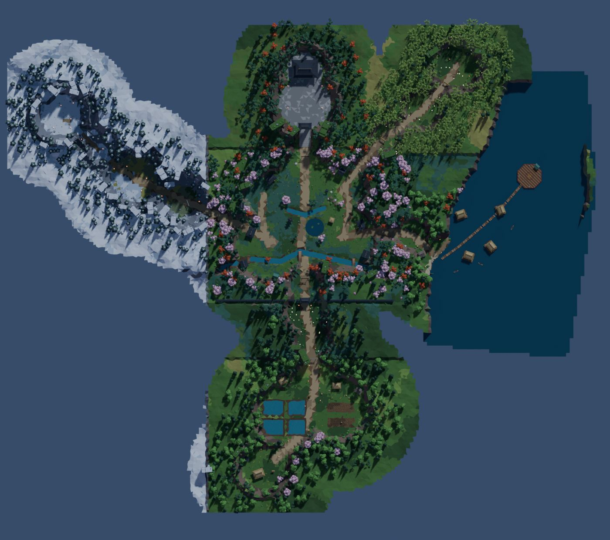

# Nindō 忍道

Juego de acción ninja low‑poly con cámara elevada (estilo *Tunic*), hecho en Unity por
Felipe Doval, Teo González, Mateo Drault y Pedro Henríquez.

> Una noche, el clan Kurokage secuestra al abuelo de Kaito. La bandana del abuelo se le ata
> sola a la frente y la guadaña se convierte en katana: Kaito hereda todo lo que su abuelo
> sabía. Para abrir las puertas del Dojo Kurokage tiene que vencer a los tres guardianes
> —Goro en la Montaña Kodoyama, Mizuchi en el Lago Kohan y Ozeki en el Bosque de Bambú—,
> recuperar sus tres sellos y enfrentar a Kage.



<p>
 
 
</p>

*(renders de previsualización hechos en Blender con la cámara del juego; en Unity la iluminación,
la niebla y el post-proceso cambian el resultado final)*

---

## Cómo abrirlo

1. Abrir la carpeta `Nindo/` con **Unity 6** (se probó la compilación contra 6000.3; el código
   mantiene compatibilidad con 2022.3 donde es barato). La primera importación tarda: hay
   ~120 modelos nuevos y el audio.
2. Abrir `Assets/Nindo/Scenes/Menu.unity` y darle Play. `Nindo.unity` es la escena de juego
   (también se puede abrir directo para probar).
3. Si Unity pregunta por actualizar paquetes (URP, Input System, VFX Graph), aceptar.

**Las escenas casi no tienen nada a propósito**: solo un `GameBootstrap`. Todo el mundo
(terreno, props, enemigos, santuarios, jefes) se construye al arrancar a partir de los modelos
exportados desde Blender y del asset `Assets/Nindo/Resources/NindoContent.asset`.
Así nadie pisa la escena del otro en Git y el mapa se regenera con un comando.

### Para probar rápido (Inspector del `GameBootstrap` en `Nindo.unity`)

| Campo | Qué hace |
|---|---|
| `debugSkipIntro` | Saltea la cinemática del secuestro y da la katana. |
| `debugStartCheckpoint` | Arranca en un santuario: `cp_home`, `cp_fields`, `cp_forest`, `cp_wall`, `cp_garden`, `cp_dojo_gate`, `cp_mountain`, `cp_mountain_top`, `cp_lake`, `cp_lake_docks`, `cp_bamboo`, `cp_dojo`. |
| `debugUnlockAll` | Dash y habilidades desbloqueados desde el principio. |

La partida se guarda en un JSON en `Application.persistentDataPath` y las opciones en
`PlayerPrefs` (menú → *Nueva partida* empieza de cero).

---

## Controles

| Acción | Teclado / mouse | Mando |
|---|---|---|
| Moverse | WASD / flechas | Stick izq. |
| Atacar (combo de 3) | J / clic izq. | □ / X · R1 / RB |
| Parry (mantener = guardia) | K / clic der. | L1 / LB |
| Esquiva (dash) | Espacio / Shift / L | ○ / B  ·  ✕ / A |
| Fijar objetivo (cambiar: stick der.) | Q / Tab / rueda | R3 |
| Remate / interactuar | F (E interactúa) | △ / Y |
| Corte del Viento (habilidad 1) | 1 / U | RT |
| Torbellino (habilidad 2) | 2 / I | LT |
| Pausa | Esc / P | Start |

## Sistema de combate (se mantuvo el formato original, pulido)

* **Parry**: bloquear justo cuando llega el golpe desequilibra al enemigo. En la ventana
  perfecta hay cámara lenta y un destello. Si termina su combo desequilibrado queda
  **Exhausto** (vulnerable, se lo puede **rematar**).
* Pegarle a un enemigo exhausto le consume el desequilibrio; cuando se recupera vuelve a la
  **guardia** y puede contraatacar.
* **Ataques 危 (imparables)**: se marcan en rojo; no se bloquean, se esquivan con el dash.
  La esquiva perfecta también ralentiza el tiempo.
* **Espíritu (maná)**: se llena con parries y golpes; lo gastan el dash, el remate y las dos
  habilidades. Al usar una habilidad la cámara se mueve detrás de Kaito (Corte del Viento:
  sobre el hombro; Torbellino: órbita baja).
* **Filo de Ira**: con poca vida, Kaito pega más fuerte. Matar cura un poco.
* Los enemigos atacan por turnos (*tokens*) para que las peleas grupales se lean bien.

---

## Estructura del proyecto

```
Nindo/Assets/Nindo/
  Scripts/        todo el código nuevo (namespace Nindo)
    Core/         Game (service locator), GameBootstrap, eventos, guardado, NindoContent, fábricas
    Input/        InputReader (teclado + mando, buffer de inputs)
    Combat/       tipos de ataque, CombatDirector (tokens), CharacterAnimator (CrossFade por código)
    Player/       PlayerController (+ .Combat), PlayerConfig
    Enemies/      Enemy, Boss, arquetipos (ninja, sumo, goro, mizuchi, ozeki, kage…)
    Camera/       CameraDirector: tomas mezclables, lock-on, shake, punch de FOV, oclusión
    FX/           partículas, hit-stop, post-proceso en runtime (URP Volume)
    Audio/        AudioManager: música por zona/combate/jefe, ambientes, efectos con pool
    UI/           HUD, menús, diálogos (todo creado por código)
    World/        WorldBuilder (arma el mapa desde los FBX), áreas, interactuables
    Story/        StoryDirector (cinemáticas, objetivos), StoryText (TODOS los textos), NPC
  Art/            modelos (props, mundo, abuelo), materiales, paleta, UI, fuentes
  Animation/      AnimatorControllers generados (usan los .anim originales del equipo)
  Audio/          Sfx/, Ambience/, Music/ (+ CREDITS.md)
  Resources/      NindoContent.asset (referencias a todo el contenido)
  Scenes/         Menu.unity, Nindo.unity
Assets/_Legacy/   el código y assets viejos que ya no se usan (se pueden borrar)
Tools/            pipelines en Python (Blender, audio, generación de assets de Unity)
```

**Para extender:**

* *Un enemigo nuevo*: agregar un arquetipo en `Enemies/EnemyArchetypes.cs` (vida, ataques
  como `AttackDef`, velocidades) y su personaje en `CharacterFactory`.
* *Un texto o diálogo*: `Story/StoryText.cs`.
* *Un prop nuevo*: función `build_<id>` en `Tools/Blender/props/props_*.py` y registrarla en
  `PROPS`. Se exporta solo, con collider y tags (luz, oclusor…) en el manifest.
* *Cambiar el mapa*: `Tools/Blender/world/world_plan.py` (áreas, caminos, edificios,
  santuarios, encuentros, jefes) y volver a correr el generador.

## Pipelines (Tools/)

```bash
B=/ruta/a/blender   # Blender 4.x
# props (modelos low-poly con la paleta de Nindō)
$B -b --python Tools/Blender/build_props.py -- --export [--module props_nature] [--only id1,id2] [--preview]
# mundo (terreno, agua, límites, vegetación, marcadores)  ~2 min
$B -b --python Tools/Blender/world/build_world.py -- --export [--map] [--preview]
# audio (descarga los packs CC0 la primera vez)
python3 Tools/Audio/build_audio.py [--only sfx|amb|music]
# metas, materiales, controllers, NindoContent, escenas  (correr después de cualquiera de los anteriores)
python3 Tools/Unity/generate_assets.py
```

Convenciones de Blender en `Tools/Blender/STYLE.md`. Los GUIDs de Unity se generan de forma
determinística, así que re-generar no rompe referencias.

### Cómo se arma el mundo

`World_Terrain.fbx` trae el terreno por chunks (`T__`), agua (`W__`), límites invisibles
(`B__`) y la decoración fusionada (`D__`: pasto, flores y arbustos en una malla por chunk de
60 m, sin GameObjects). Cada `World_<zona>.fbx` trae *empties*:

* `P__<prop>__…` → se instancia el prefab del prop con su collider/luces.
* `M__<Tipo>__<args>` → marcadores de gameplay: `Start`, `Checkpoint`, `Encounter`, `Enemy`,
  `BossArena`, `Boss`, `Zone`, `Trigger`, `Portal`, `Door`, `Barrier`, `NPC`, `Fireflies`,
  `SealGate`.

Después se hace *static batching*, se construye el NavMesh en runtime y se reparten las
luces puntuales con un pool (solo se encienden las más cercanas).

---

## Estado y lo que hay que revisar en Unity

Este trabajo se hizo desde un entorno en la nube **sin poder abrir el editor de Unity**:
todo el código compila sin errores contra las DLLs de Unity 6 (editor y player), los
modelos se revisaron con renders de Blender y el audio con análisis de nivel/espectro, pero
**nada se probó jugando**. En la primera abierta conviene revisar:

1. Que `NindoContent` tenga todo asignado (Consola: avisos `[Nindo] Falta…`).
2. Escala/orientación de props y del mundo (los FBX usan `bake_space_transform`).
3. Materiales URP (paleta, emisivo, follaje con viento, agua) y el skybox `Nindo/Night Sky`.
4. Tiempos de los ataques y de las ventanas de parry (`PlayerConfig`, `EnemyArchetypes`).
5. Que el NavMesh en runtime cubra bien los caminos (agentes de radio 0.45).
6. Volúmenes de audio (`NindoContent` → sfx/music/ambience → volume).

**Unity MCP**: el MCP de Unity funciona cuando Claude Code corre en la misma computadora que
el editor (servidor local). Desde una sesión en la nube no hay forma de conectarse; para
usarlo hay que abrir Claude Code localmente con el paquete MCP instalado en el proyecto.

## Créditos

Código, diseño y modelos originales de personajes/enemigos: el equipo de Nindō.
Entornos low‑poly, terreno y efectos sintetizados: generados con los scripts de `Tools/`.
Música y efectos de terceros: todo CC0, detallado en `Nindo/Assets/Nindo/Audio/CREDITS.md`.
Fuentes: Shippori Mincho B1 y Zen Maru Gothic (SIL Open Font License).
